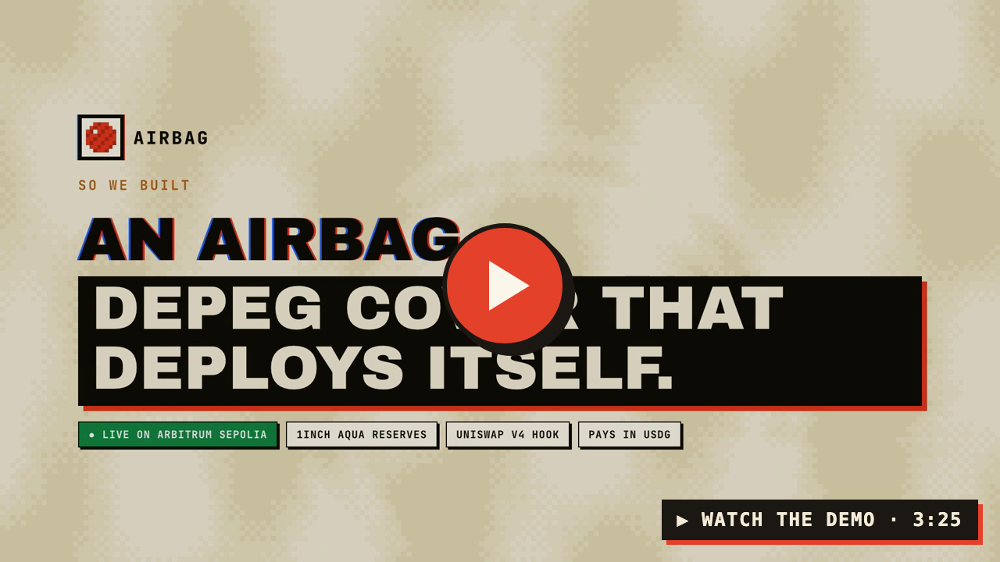
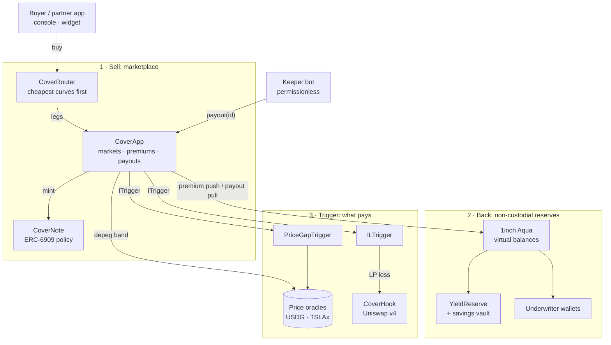

# Airbag

**Depeg cover that deploys itself.**

Airbag is a parametric insurance protocol for stablecoins on Arbitrum. Buyers pay a small premium and hold a
transferable cover note. When the insured event happens (a **USDG depeg**, a **Uniswap v4 LP loss** or a
**tokenized-stock gap-down**), a permissionless keeper fires the payout and **the USDG lands in the holder's
wallet automatically**, with no claim form, no committee and no waiting period. Underwriters back the cover
from their **own wallets through 1inch Aqua**, publish their own risk curves, and compete on price.

**Live on Arbitrum Sepolia** · **13 contracts, all source-verified** · **34 Foundry tests passing** · three
live cover products · automatic payouts · 3 competing underwriters · a real Uniswap v4 pool + hook

## Demo Video

[](https://youtu.be/AGcrzesFw2s)

| | |
|---|---|
| 🌐 **Live app** | **[airbag.insure](https://airbag.insure)**: Arbitrum Sepolia, connect MetaMask (test USDG is free to mint) |
| 📜 **Contracts** | [Deployed addresses](#61-deployed-contracts-arbitrum-sepolia--chain-421614) (all verified on Sourcify) · history in [`DEPLOYMENTS.md`](DEPLOYMENTS.md) |
| 🧩 **Integrate** | `/integrate` in the app: a drop-in "Protect this balance" widget and a one-call contract API |
| 🧪 **Try it yourself** | [Run it locally](#11-run-it-locally), or open the live app, connect MetaMask on Arbitrum Sepolia and mint test USDG |

---

## Contents

1. [The problem](#1-the-problem)
2. [The solution](#2-the-solution)
3. [How it works (worked example)](#3-how-it-works)
4. [What's live](#4-whats-live)
5. [Solvency model: what is guaranteed, what is not](#5-solvency-model)
6. [Architecture](#6-architecture) · [deployed contracts](#61-deployed-contracts-arbitrum-sepolia--chain-421614)
7. [Tech stack & integration status](#7-tech-stack--integration-status)
8. [Market fit](#8-market-fit)
9. [Roadmap & milestones](#9-roadmap--milestones)
10. [Judging criteria](#10-judging-criteria)
11. [Run it locally](#11-run-it-locally)
12. [Repository layout](#12-repository-layout)
13. [Security, limits & honest caveats](#13-security-limits--honest-caveats)
14. [Further reading](#14-further-reading)

---

## 1. The problem

**Stablecoins are becoming real money, and almost nobody can insure them.**

- **Pegs break.** On 11 March 2023, USDC fell to about **$0.87** after Circle disclosed that $3.3B of its
  reserves were stuck at Silicon Valley Bank. It took about three days to recover
  ([CNBC](https://www.cnbc.com/2023/03/11/stablecoin-usdc-breaks-dollar-peg-after-firm-reveals-it-has-3point3-billion-in-svb-exposure.html)).
  A peg is only as strong as the bank the reserves sit in.
- **On-chain cover barely exists.** Less than 2% of DeFi's total value locked is insured, and insurance capital
  is in the hundreds of millions against roughly $100B of deposits
  ([bex.co](https://bex.co/blog/2026/05/03/defi-insurance-450m-q1-hacks-coverage-gap)).
- **Existing cover pays slowly and discretionarily.** Claims go through assessment votes, committees and waiting
  periods. When a peg breaks, holders need the money *now*, not after a governance process.
- **Regulated stablecoins are growing up.** Paxos's Global Dollar (**USDG**) is issued under Singapore's MAS
  framework and the EU's MiCA, which makes it the kind of dollar that payment apps, payroll tools and treasuries
  actually hold. Those users want protection they can explain to an auditor.

## 2. The solution

Airbag combines four ideas in one product:

| | What it does | Why it matters |
|---|---|---|
| **Parametric trigger** | Each product has an objective trigger: USDG ≤ $0.97, LP loss past 0.5%, or TSLAx below $250 | No claims process and no dispute: the oracle or the pool price decides |
| **Automatic payout** | A permissionless keeper calls `payout(policyId)` the moment the trigger fires, and the USDG goes to whoever holds the note | **The insured doesn't even have to be online.** This is the "airbag" |
| **Non-custodial reserve on 1inch Aqua** | Underwriters `ship` a USDG reserve to Aqua as a *virtual balance*. The tokens stay in their own wallet, or in a savings vault earning yield | No pooled honeypot. Capital can earn premiums **and** vault yield at the same time |
| **Competitive marketplace** | Every underwriter publishes a risk curve. A router splits each order across the cheapest curves atomically | Price discovery for risk, instead of an admin-set rate |

Around it: **ERC-6909 cover notes** make cover transferable (the holder is paid), a **solvency floor** stops
any market selling more cover than it can pay, and a **checkout widget** lets any app sell Airbag cover to its
own users.

## 3. How it works

**The buyer.** Alice holds 50,000 USDG in her wallet and wants 7 days of depeg cover. These are live quotes from
the Arbitrum Sepolia deployment for exactly that order:

| Underwriter | Risk curve (annual rate) | Quote for 50,000 USDG · 7 days |
|---|---|---:|
| Airbag Genesis (reserve in a savings vault) | 1% → 10% as the book fills | 36.54 USDG |
| Underwriter B | 0.6% → 14%, cheap until busy | **6.99 USDG** |
| Underwriter C | 1.5% → 6%, steady | 18.87 USDG |

The router sends Alice's order to the cheapest curve. She pays **6.99 USDG** (about 0.73% a year) and receives an
ERC-6909 cover note.

**The depeg.** USDG trades at $0.92, below the $0.97 trigger. Within one keeper round, the keeper calls
`payout()` and **50,000 USDG lands in Alice's wallet**. She sends no transaction and fills in no form. If she had
sold or gifted the note, the new holder would be paid instead.

**No depeg.** The policy expires, anyone settles it with `expire()`, and the capacity is freed for the next
buyer. The underwriter keeps the premium.

**The other two products** use the same engine with a different trigger:

| Product | Trigger | Example payout on 100,000 USDG of cover |
|---|---|---|
| **Uniswap v4 LP loss** (wstETH/WETH) | LP impermanent loss measured by `CoverHook` | 1.98% LP loss, 0.5% deductible, 5% cap → **32,880 USDG** |
| **Tokenized-stock gap-down** (TSLAx) | Oracle price below the $250 strike | TSLAx at $200 (−20%) → **20,000 USDG** |

**The underwriter.** An underwriter earns two streams on the same capital: **premiums** from every policy sold
against their curve, and **savings-vault yield** on the reserve (4.5% APR in the demo), which is withdrawn just
in time only when a payout fires. The console shows the book's expected APY, premiums, vault yield, payouts,
net P&L and loss ratio.

**Pricing honesty:** premiums are an **annual rate × term**, like real insurance. Rates rise with utilization
along the underwriter's curve, and each order is priced at its post-trade utilization, so the last buyer before
a market fills pays the most.

## 4. What's live

Everything below runs against the deployed contracts on Arbitrum Sepolia.

| Area | Features |
|---|---|
| **Buy cover** | Three products in one catalog · amount and term · live quote · the risk curve with "now" and "your rate" markers · the order book across underwriters, with your fill per underwriter · one-transaction routed buy · LP flow: "Become an LP" on the real v4 pool, then buy + link cover to the position |
| **Automatic payout** | Keeper bot (`frontend/scripts/keeper.mjs`) fires every triggered policy · the "Airbag deployed" banner when a payout lands in your wallet · a manual "Claim now" is still available |
| **Event simulator** | Move the USDG feed ("Depeg → $0.92") · move the TSLAx feed ("Earnings miss −20%") · a real swap through the v4 pool ("wstETH depeg −33%") |
| **Underwrite** | Your book: expected APY (premiums + vault), premiums, vault yield, payouts, net P&L, loss ratio · per-market table · open a new market: reserve, trigger band, solvency floor, and a **draggable risk-curve editor** with presets |
| **Keeper** | Every open policy with its status · run a keeper round from the browser (payout what's due, settle what lapsed) |
| **Integrate** | `/app/embed?amount=…&partner=…`: a "Protect your 25,000 USDG" widget any app can iframe · `/integrate`: live preview, the iframe snippet and the contract call |

Verified end to end: 34 Foundry tests (including a full lifecycle suite, an 8,192-call invariant fuzz and a
real v4 IL-cover suite), browser runs of every flow on a local chain and on Arbitrum Sepolia, and a keeper that
paid out depeg, LP-loss and stock-gap policies automatically.

## 5. Solvency model

What Airbag guarantees, and what it doesn't. We keep this honest.

| Property | How it's enforced | Guaranteed? |
|---|---|---|
| A market can't sell more cover than its floor allows | `outstanding ≤ backing × maxUtil`, checked on every buy (reverts otherwise); fuzzed with 8,192 random buys | ✅ on-chain |
| Payouts are paid from real reserves | `aqua.pull()` transfers from the underwriter's wallet in the same transaction, and reverts if unbacked | ✅ atomic |
| Solvency is publicly checkable | `solvency(market)` returns backing, cover in force and utilization at any block | ✅ anyone can read it |
| Cover can't be bought after the loss (LP product) | the policy is bound to the LP's position at a baseline price; the loss is measured from there | ✅ tested |
| Flash-loan price pushes can't fake an LP claim | `CoverHook` measures from the **block-open** price, not the live price | ✅ tested |
| The reserve can't be withdrawn while cover is outstanding | Aqua lets a maker `dock` (withdraw) at any time | ❌ **not enforced**, see §13 |
| One wallet can't back two markets with the same USDG | Aqua balances are virtual; only the optional `SolventBook` aggregate floor catches double counting | 🟡 optional |

## 6. Architecture



| Contract | Role |
|---|---|
| `CoverApp` | The core. Registers markets (an Aqua strategy each), prices premiums on the risk curve (annual rate × term), enforces the solvency floor, mints notes, and settles through `payout()` (anyone, pays the holder), `claim()` (the holder) or `expire()` (anyone, after expiry) |
| `CoverNote` | ERC-6909 policy notes: transferable, with `holderOf` so the keeper knows who to pay |
| `CoverRouter` | Marketplace executor: fills a solver-built route across many underwriters atomically, with a premium cap and refund |
| `RiskCurve` (library) | `rate(u) = start + (end − start) · u^k`, monotonic in utilization |
| `CoverHook` | Uniswap v4 hook: records each LP's entry and exit (the real LP via `IMsgSender`), full-range IL maths, block-open price guard, depeg flag |
| `ILTrigger` | Maps v4 LP loss to a payout: bind a policy to a live position, pay `(IL − deductible) / (cap − deductible)` |
| `PriceGapTrigger` | Pays the percentage an asset falls below a strike (tokenized stocks, RWAs) |
| `YieldReserve` | Underwriter account whose reserve sits in an ERC-4626 vault; withdraws just in time when a payout fires |
| `SolventBook` · `TranchedReserve` | Built and tested, not in the live flow: an attestor-fed aggregate solvency floor, and junior/senior reinsurance tranches |

### 6.1 Deployed contracts (Arbitrum Sepolia · chain 421614)

All 13 contracts are verified on **Sourcify (exact match)**. Click an address to open it on Arbiscan.

| Contract | Role | Address |
|---|---|---|
| **CoverApp** | Core: markets, premiums, payouts | [`0xFc0684F87919be2aFfD4c8864D33e51e8E66D78A`](https://sepolia.arbiscan.io/address/0xFc0684F87919be2aFfD4c8864D33e51e8E66D78A) |
| **CoverRouter** | Marketplace: routed buys | [`0xA6304E024710b06d05AA33F9c4740E6dB854047F`](https://sepolia.arbiscan.io/address/0xA6304E024710b06d05AA33F9c4740E6dB854047F) |
| **CoverNote** | ERC-6909 cover notes | [`0x486f724f8320219918F5089F7FB4a27af24AE5cb`](https://sepolia.arbiscan.io/address/0x486f724f8320219918F5089F7FB4a27af24AE5cb) |
| **CoverHook** | Uniswap v4 hook (LP loss) | [`0xc72F5F6d244Fb43B070C2BF8dA15e2DF86f04ac0`](https://sepolia.arbiscan.io/address/0xc72F5F6d244Fb43B070C2BF8dA15e2DF86f04ac0) |
| **ILTrigger** | LP-loss payouts | [`0x75390487FF8218A0Bf120B503D352CdF211d5a2A`](https://sepolia.arbiscan.io/address/0x75390487FF8218A0Bf120B503D352CdF211d5a2A) |
| **PriceGapTrigger** | Stock gap-down payouts | [`0x00cF0DD325070E60380917ECc98Be856ac93fc64`](https://sepolia.arbiscan.io/address/0x00cF0DD325070E60380917ECc98Be856ac93fc64) |
| **Aqua** | 1inch Aqua, unmodified copy (see §7) | [`0xe94b3Af2Bf8f43B76033C439e5b5b4F4144bB993`](https://sepolia.arbiscan.io/address/0xe94b3Af2Bf8f43B76033C439e5b5b4F4144bB993) |
| **YieldReserve** | Genesis underwriter, reserve in a vault | [`0x8f27ab5c57dcBd4faD7031cC94767e3C8dd3F708`](https://sepolia.arbiscan.io/address/0x8f27ab5c57dcBd4faD7031cC94767e3C8dd3F708) |
| **DripVault** | Demo savings vault (4.5% APR) | [`0x5C6d9d18ec0D64D5915a53f814F680B319CCB249`](https://sepolia.arbiscan.io/address/0x5C6d9d18ec0D64D5915a53f814F680B319CCB249) |
| **USDG (test)** | Mintable test USDG | [`0xBF45D57C483b66B00500977C58A909aaC6B703f9`](https://sepolia.arbiscan.io/address/0xBF45D57C483b66B00500977C58A909aaC6B703f9) |
| **USDG/USD feed (demo)** | Settable price feed | [`0xEc4891565e3a046D6d12080A902885003fd2304D`](https://sepolia.arbiscan.io/address/0xEc4891565e3a046D6d12080A902885003fd2304D) |
| **TSLAx/USD feed (demo)** | Settable price feed | [`0x1927D42D90e2FA653E82cDe95842bBbCbBF0Bc0C`](https://sepolia.arbiscan.io/address/0x1927D42D90e2FA653E82cDe95842bBbCbBF0Bc0C) |
| **DemoLiquidityRouter** | v4 LP router exposing the real LP (like PositionManager) | [`0x0534fcA33D3bf12538dC3C2c6950De00528bD57A`](https://sepolia.arbiscan.io/address/0x0534fcA33D3bf12538dC3C2c6950De00528bD57A) |

**External contracts used**

| | Address |
|---|---|
| Uniswap v4 PoolManager (official) | [`0xFB3e0C6F74eB1a21CC1Da29aeC80D2Dfe6C9a317`](https://sepolia.arbiscan.io/address/0xFB3e0C6F74eB1a21CC1Da29aeC80D2Dfe6C9a317) |
| 1inch Aqua, canonical (Arbitrum **One**) | `0x499943e74fb0ce105688beee8ef2abec5d936d31` |

**Markets:** USDG depeg from three underwriters (Genesis `0x60e5…7604`, B `0x4deb…b44d`, C `0xa500…000e`),
Uniswap v4 LP loss on wstETH/WETH (`0xe728…70ed`), and TSLAx gap-down (`0x895e…b02c`). v4 pool id
`0x9afa…71be`.

**Deployer / genesis underwriter:** [`0x204a73e8303F3d09B12062dEdAA74B1CDA6E167d`](https://sepolia.arbiscan.io/address/0x204a73e8303F3d09B12062dEdAA74B1CDA6E167d).
Underwriters B and C and the seed buyers are throwaway wallets derived from the deployer key. Full list and
redeploy notes: [`DEPLOYMENTS.md`](DEPLOYMENTS.md).

## 7. Tech stack & integration status

We keep this table honest: **live** means it runs in the demo flow today.

| Technology | Status | How it's used |
|---|---|---|
| **1inch Aqua** | ✅ **Live**, the reserve layer | Every market is an Aqua strategy: `ship` the reserve, `push` premiums, `pull` payouts. 1inch hasn't deployed Aqua on Arbitrum Sepolia, so we deployed their **unmodified** contract; the canonical Aqua on Arbitrum One is a drop-in for mainnet |
| **Uniswap v4** | ✅ **Live** | `CoverHook` on the official Arbitrum Sepolia PoolManager, with a real wstETH/WETH pool. The LP-loss product reads the hook |
| **Arbitrum Sepolia** | ✅ **Live** | 13 contracts deployed and source-verified |
| **USDG** | ✅ **Live (test token)** | Cover, premiums, payouts and reserves are all denominated in USDG. On testnet it's a mintable stand-in |
| **Price oracles** | 🟡 **Demo feeds live**, adapters built | The demo uses settable feeds so judges can trigger events. `ChainlinkOracleAdapter` and `PythOracleAdapter` (with staleness checks) are built for mainnet |
| **Keeper** | ✅ **Live** | `frontend/scripts/keeper.mjs`, permissionless, fires payouts and settles expiries |
| Solvency book, tranches, cross-chain cover, futarchy pricing, hedge executor, slippage refund, verified-market registry | 🟡 **Built and tested, not in the live flow** | Plug-in products and reserve structures on the same engine (`ITrigger`, `IPremiumPricer`) |
| Frontend | ✅ | Next.js 16 + wagmi 3 + viem, MetaMask on Arbitrum Sepolia |
| Tooling | ✅ | Foundry (34 tests, invariant fuzzing), anvil demo chain with one-command reset |

## 8. Market fit

**Who it's for**

| Segment | Pain today | What Airbag gives them |
|---|---|---|
| **Stablecoin holders** (people, DAOs, treasuries) | A depeg can take 13% of their money overnight, and there's nothing to buy | Cheap parametric cover that pays in one block, automatically |
| **Payment, payroll & treasury apps** | Holding float in stablecoins is a risk they can't explain away | A "protect this balance" button inside their own product |
| **Liquidity providers** | Impermanent loss when a pair depegs (wstETH/WETH, stable pairs) | LP-loss cover bound to their v4 position |
| **RWA and tokenized-stock holders** | Gap risk at the open, around earnings or halts | Proportional gap-down cover |
| **Underwriters** (funds, market makers, yield seekers) | Idle stablecoins earn little; insurance pools lock capital | Premiums **plus** savings yield on capital that never leaves their wallet |

**Why now**
- **Regulated stablecoins are going mainstream** (USDG under MAS and MiCA), and they're being used as real money.
- **Pegs have broken before** (USDC at $0.87 in 2023), and holders now know it can happen.
- **Shared-liquidity rails exist.** 1inch Aqua makes non-custodial reserves practical, and Uniswap v4 hooks make
  on-chain loss measurement possible.

**Business model** (planned for mainnet)
- **Protocol fee on premiums**: a take rate on every policy sold; the rest goes to underwriters.
- **Distribution revenue share**: partners embedding the widget earn a share of the premiums they originate.
- **Keeper incentives**: a small payout tip for whoever fires a triggered policy.
- **Premium products**: custom triggers (`ITrigger`) for treasuries and RWA platforms.

**Go-to-market**
1. **USDG depeg cover on Arbitrum** as the wedge: simple to explain, simple to demo ("the airbag deploys itself").
2. **Widget distribution**: wallets, payment apps and RWA platforms sell cover at checkout.
3. **Underwriter program**: seed curves with market makers and savings-vault capital.
4. **More triggers**: LP loss, gap-down, and partner-defined events on the same engine.

**Competitive landscape**
- Discretionary cover mutuals pay after claims assessment and votes, and pool capital in custody.
- Prediction markets price events but aren't insurance: no automatic payout to a policy holder, no solvency floor.
- Airbag is **parametric, auto-paying, non-custodial and marketplace-priced**, all four at once.

## 9. Roadmap & milestones

| Milestone | Scope | Success metric |
|---|---|---|
| **M0 · Buildathon (done)** | 13 verified contracts on Arbitrum Sepolia · three cover products · automatic payouts · marketplace with 3 underwriters · yield-bearing reserves · console, widget and integrate page | Every flow works end to end on the live testnet |
| **M1 · Mainnet beta (≈ 6–8 weeks)** | Security review of `CoverApp`, `CoverRouter`, `CoverHook`, triggers · Arbitrum One on the canonical 1inch Aqua with real USDG · Chainlink / Pyth feeds · keeper tips · per-market caps · **reserve lock-up while cover is outstanding** | Beta live with capped capacity · first real premiums paid to underwriters |
| **M2 · Distribution (≈ 3 months)** | Widget partners (wallets, payment apps) · SolventBook aggregate floor on by default · tranched reserves for institutional underwriters | Premium volume · partner-originated share |
| **M3 · More risk (≈ 6 months)** | Position-sized LP cover · more assets and RWAs · cross-chain cover · governance for new triggers | Number of live triggers · retained underwriter capital |

## 10. Judging criteria

| Criterion | How Airbag addresses it |
|---|---|
| **Innovation & creativity** | Insurance that **pays itself**: a parametric trigger plus a permissionless keeper means no claim at all. Reserves that stay in the underwriter's wallet (Aqua) and earn yield while backing cover. A marketplace of underwriter risk curves. LP-loss cover measured by a v4 hook with a flash-loan guard |
| **Technical execution** | 34 tests including lifecycle, invariant fuzzing and a real v4 pool suite · 13 verified contracts live · on-chain solvency floor · atomic routed buys · no event-log dependence (state reads only) |
| **Real problem solving** | Stablecoin holders can't insure a depeg today, and existing cover pays slowly. Airbag pays in one block |
| **Product-market fit** | Clear buyers, a distribution wedge (the widget), an underwriter yield story and a fee model (see §8) |
| **USDG** | USDG is the insured asset, the premium, the reserve and the payout |
| **Arbitrum** | Built and deployed on Arbitrum Sepolia, mainnet-ready on Arbitrum One's live Aqua and v4 |

## 11. Run it locally

**Prerequisites:** Node ≥ 20, [Foundry](https://book.getfoundry.sh), and for testnet a browser wallet with a
little Arbitrum Sepolia ETH.

**Contracts**
```bash
cd airbag
forge build
forge test             # 34 tests in 10 suites
```
Setup note: `lib/` symlinks the 1inch libraries vendored under `../winner-usecases/liquid_OB` and Uniswap v4
from `../unizwap/contract/lib`; both are wired through `remappings.txt`.

**Full local demo** (anvil + every product + seeded book + keeper, one command)
```bash
cd airbag && ./demo-reset.sh
cd frontend && npm install && npm run dev      # http://localhost:3000/app
```
On the local chain the header has demo accounts (Buyer / Underwriter, no wallet needed) and a time machine, so
expiries and vault yield can be shown in seconds. Re-run `demo-reset.sh` for a clean slate.

**Against the live testnet**
```bash
cd airbag/frontend
npm run build && npm start          # production builds use the Arbitrum Sepolia addresses
```
Connect MetaMask, switch to Arbitrum Sepolia, click "Get test USDG" and buy cover.

**Deploy your own copy** (put `PRIVATE_KEY` and `ETHERSCAN_API_KEY` in `airbag/.env`)
```bash
POOL_MANAGER=0xFB3e0C6F74eB1a21CC1Da29aeC80D2Dfe6C9a317 forge script script/DeployDemo.s.sol \
  --rpc-url https://sepolia-rollup.arbitrum.io/rpc --private-key $PRIVATE_KEY --broadcast --slow
forge script script/AddMarketplace.s.sol --rpc-url https://sepolia-rollup.arbitrum.io/rpc \
  --private-key $PRIVATE_KEY --broadcast --slow
VERIFIER=sourcify ./verify-sepolia.sh
```

**Deploying the UI:** a standard Next.js app. Set the project root to `airbag/frontend`; no environment
variables are needed (optional: `NEXT_PUBLIC_RPC_URL`).

**Keep automatic payouts running during judging**
```bash
cd airbag && nohup ./keeper-sepolia.sh > /tmp/airbag-demo/keeper-sepolia.log 2>&1 &
```
It reads the key from `.env`, restarts itself on crashes, and keeps the demo price feeds fresh.

## 12. Repository layout

```
airbag/
├── src/                  Solidity (≈1,750 lines core, ≈3,000 with vendored curve maths and mocks)
│   ├── CoverApp · CoverNote · CoverRouter · CoverHook · YieldReserve · SolventBook · TranchedReserve
│   ├── triggers/         ILTrigger · PriceGapTrigger · SlippageRefundTrigger · BookSolvencyTrigger
│   ├── libraries/        RiskCurve · CurveKernelPricer
│   ├── oracles/          Chainlink + Pyth adapters
│   └── crosschain/ futarchy/ hedge/ registry/ mocks/
├── test/                 Foundry tests (10 suites, 34 tests)
├── script/               DeployDemo · AddMarketplace · Deploy · DeployHook
├── frontend/             Next.js app: landing, console, widget, integrate · scripts/keeper.mjs
├── demo-reset.sh         One-command local demo
├── keeper-sepolia.sh     Self-restarting testnet keeper
├── verify-sepolia.sh     Sourcify / Arbiscan verification
└── DEPLOYMENTS.md        Addresses, markets, redeploy notes
```

## 13. Security, limits & honest caveats

- **Testnet only, not audited.** Don't use it with real funds. A security review is milestone M1.
- **Reserves aren't locked.** Aqua lets an underwriter `dock` a market at any time, even with cover outstanding.
  Solvency is **checkable on-chain**, not enforced after the fact. A lock-up while cover is outstanding is on
  the M1 roadmap.
- **Shared reserves can be double counted.** Aqua balances are virtual, so one wallet can back several markets
  with the same USDG. The `SolventBook` aggregate floor handles this but is off in the demo.
- **LP-loss cover is an index.** It pays a share of the policy notional based on the pool's IL; the notional
  isn't capped by the size of the LP's position.
- **Testnet stand-ins:** test USDG, settable price feeds (so judges can trigger events), a demo savings vault,
  our own copy of 1inch's unmodified Aqua, and throwaway wallets for the extra underwriters and seed buyers.
- **Keeper liveness:** automatic payouts need a keeper running. If none is, holders can still `claim()`
  themselves, and anyone can fire `payout()`.
- **Bugs found and fixed during the build:** premiums first ignored the policy term (a 5-minute policy cost the
  same as a 30-day one); they are now an annual rate × term, with a test. Expired policies originally locked
  capacity forever; `expire()` now releases it, covered by the lifecycle suite.

## 14. Further reading

- [`DEPLOYMENTS.md`](DEPLOYMENTS.md): contracts, markets and redeploy history
- [`frontend/README.md`](frontend/README.md): running the app, the demo script and the keeper
- [`../airbag-insurance-protocol.md`](../airbag-insurance-protocol.md): protocol design
- [`../airbag-submission-brief.md`](../airbag-submission-brief.md) · [`../arbitrum-buildathon-winplan.md`](../arbitrum-buildathon-winplan.md): positioning notes

Solidity sources are MIT-licensed (SPDX headers), except the vendored ArcBook curve kernel under `src/curve/`
(AGPL-3.0, attributed).
